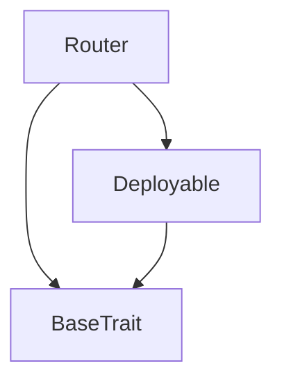
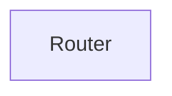

# TACT Compilation Report
Contract: Router
BOC Size: 1834 bytes

# Types
Total Types: 19

## StateInit
TLB: `_ code:^cell data:^cell = StateInit`
Signature: `StateInit{code:^cell,data:^cell}`

## StdAddress
TLB: `_ workchain:int8 address:uint256 = StdAddress`
Signature: `StdAddress{workchain:int8,address:uint256}`

## VarAddress
TLB: `_ workchain:int32 address:^slice = VarAddress`
Signature: `VarAddress{workchain:int32,address:^slice}`

## Context
TLB: `_ bounced:bool sender:address value:int257 raw:^slice = Context`
Signature: `Context{bounced:bool,sender:address,value:int257,raw:^slice}`

## SendParameters
TLB: `_ bounce:bool to:address value:int257 mode:int257 body:Maybe ^cell code:Maybe ^cell data:Maybe ^cell = SendParameters`
Signature: `SendParameters{bounce:bool,to:address,value:int257,mode:int257,body:Maybe ^cell,code:Maybe ^cell,data:Maybe ^cell}`

## Deploy
TLB: `deploy#946a98b6 queryId:uint64 = Deploy`
Signature: `Deploy{queryId:uint64}`

## DeployOk
TLB: `deploy_ok#aff90f57 queryId:uint64 = DeployOk`
Signature: `DeployOk{queryId:uint64}`

## FactoryDeploy
TLB: `factory_deploy#6d0ff13b queryId:uint64 cashback:address = FactoryDeploy`
Signature: `FactoryDeploy{queryId:uint64,cashback:address}`

## ProxyMsg
TLB: `proxy_msg#d2804033 to:address value:coins body:^cell = ProxyMsg`
Signature: `ProxyMsg{to:address,value:coins,body:^cell}`

## Deposit
TLB: `deposit#b02ba76c query_id:uint64 value:coins signature:^slice = Deposit`
Signature: `Deposit{query_id:uint64,value:coins,signature:^slice}`

## TransferOwnership
TLB: `transfer_ownership#6b58f3fd query_id:uint64 new_owner:address = TransferOwnership`
Signature: `TransferOwnership{query_id:uint64,new_owner:address}`

## SetReferalAddress
TLB: `set_referal_address#49798b39 query_id:uint64 referal_address:address = SetReferalAddress`
Signature: `SetReferalAddress{query_id:uint64,referal_address:address}`

## SetPrizeAddress
TLB: `set_prize_address#354fb17d query_id:uint64 prize_address:address = SetPrizeAddress`
Signature: `SetPrizeAddress{query_id:uint64,prize_address:address}`

## SetMainAddress
TLB: `set_main_address#9715ed31 query_id:uint64 main_address:address = SetMainAddress`
Signature: `SetMainAddress{query_id:uint64,main_address:address}`

## UpdatePublicKey
TLB: `update_public_key#5f4f68d6 query_id:uint64 new_public_key:uint256 = UpdatePublicKey`
Signature: `UpdatePublicKey{query_id:uint64,new_public_key:uint256}`

## UpdateValue
TLB: `update_value#5265bdc6 query_id:uint64 new_value:coins = UpdateValue`
Signature: `UpdateValue{query_id:uint64,new_value:coins}`

## Divider
TLB: `_ numerator:int257 denominator:int257 = Divider`
Signature: `Divider{numerator:int257,denominator:int257}`

## SetDividors
TLB: `set_dividors#f8af42f9 query_id:uint64 ref_divider:Divider{numerator:int257,denominator:int257} prize_divider:Divider{numerator:int257,denominator:int257} = SetDividors`
Signature: `SetDividors{query_id:uint64,ref_divider:Divider{numerator:int257,denominator:int257},prize_divider:Divider{numerator:int257,denominator:int257}}`

## Router$Data
TLB: `null`
Signature: `null`

# Get Methods
Total Get Methods: 6

## getMainAddress

## getPrizeAddress

## getReferalAddress

## getValue

## getRefDivider

## getPrizeDivider

# Error Codes
2: Stack underflow
3: Stack overflow
4: Integer overflow
5: Integer out of expected range
6: Invalid opcode
7: Type check error
8: Cell overflow
9: Cell underflow
10: Dictionary error
11: 'Unknown' error
12: Fatal error
13: Out of gas error
14: Virtualization error
32: Action list is invalid
33: Action list is too long
34: Action is invalid or not supported
35: Invalid source address in outbound message
36: Invalid destination address in outbound message
37: Not enough TON
38: Not enough extra-currencies
39: Outbound message does not fit into a cell after rewriting
40: Cannot process a message
41: Library reference is null
42: Library change action error
43: Exceeded maximum number of cells in the library or the maximum depth of the Merkle tree
50: Account state size exceeded limits
128: Null reference exception
129: Invalid serialization prefix
130: Invalid incoming message
131: Constraints error
132: Access denied
133: Contract stopped
134: Invalid argument
135: Code of a contract was not found
136: Invalid address
137: Masterchain support is not enabled for this contract
4090: Only owner can set dividors
6827: Only owner can set prize address
12603: Only owner can proxy message
28099: Only owner can set referal address
36952: Only owner can transfer
37779: Only owner can set main address
46826: Only owner can update public key
48401: Invalid signature
53983: Price requirement is not met
57449: Only owner can set value
61734: Only owner can deposit

# Trait Inheritance Diagram

# Contract Dependency Diagram

