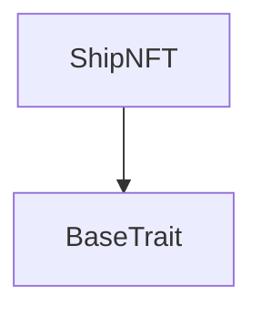
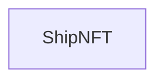

# TACT Compilation Report
Contract: ShipNFT
BOC Size: 1586 bytes

# Types
Total Types: 39

## StateInit
TLB: `_ code:^cell data:^cell = StateInit`
Signature: `StateInit{code:^cell,data:^cell}`

## Context
TLB: `_ bounced:bool sender:address value:int257 raw:^slice = Context`
Signature: `Context{bounced:bool,sender:address,value:int257,raw:^slice}`

## SendParameters
TLB: `_ bounce:bool to:address value:int257 mode:int257 body:Maybe ^cell code:Maybe ^cell data:Maybe ^cell = SendParameters`
Signature: `SendParameters{bounce:bool,to:address,value:int257,mode:int257,body:Maybe ^cell,code:Maybe ^cell,data:Maybe ^cell}`

## Deploy
TLB: `deploy#946a98b6 queryId:uint64 = Deploy`
Signature: `Deploy{queryId:uint64}`

## DeployOk
TLB: `deploy_ok#aff90f57 queryId:uint64 = DeployOk`
Signature: `DeployOk{queryId:uint64}`

## FactoryDeploy
TLB: `factory_deploy#6d0ff13b queryId:uint64 cashback:address = FactoryDeploy`
Signature: `FactoryDeploy{queryId:uint64,cashback:address}`

## MintShipNFT
TLB: `mint_ship_nft#c72bea97 new_owner:address content:^cell = MintShipNFT`
Signature: `MintShipNFT{new_owner:address,content:^cell}`

## OwnershipAssigned
TLB: `ownership_assigned#05138d91 query_id:uint64 prev_owner:address forward_payload:remainder<slice> = OwnershipAssigned`
Signature: `OwnershipAssigned{query_id:uint64,prev_owner:address,forward_payload:remainder<slice>}`

## CollectionData
TLB: `_ next_item_index:int257 collection_content:^cell owner_address:address = CollectionData`
Signature: `CollectionData{next_item_index:int257,collection_content:^cell,owner_address:address}`

## WithdrawFunds
TLB: `withdraw_funds#7a3247bf query_id:int257 = WithdrawFunds`
Signature: `WithdrawFunds{query_id:int257}`

## WithdrawalConfirmation
TLB: `_ query_id:int257 amount:int257 = WithdrawalConfirmation`
Signature: `WithdrawalConfirmation{query_id:int257,amount:int257}`

## VerifySingle
TLB: `verify_single#5fd60989 ship_level:int257 signature:^slice = VerifySingle`
Signature: `VerifySingle{ship_level:int257,signature:^slice}`

## UpdatePublicKey
TLB: `update_public_key#694e9722 query_id:int257 new_public_key:int257 = UpdatePublicKey`
Signature: `UpdatePublicKey{query_id:int257,new_public_key:int257}`

## ChangeOwner
TLB: `change_owner#d9ae38fe new_owner:address = ChangeOwner`
Signature: `ChangeOwner{new_owner:address}`

## ChangeNFTContent
TLB: `change_nft_content#1091f31e new_nft_content:^cell = ChangeNFTContent`
Signature: `ChangeNFTContent{new_nft_content:^cell}`

## LogEventShipAssembled
TLB: `log_event_ship_assembled#668ce31d user:address nft_received:^cell = LogEventShipAssembled`
Signature: `LogEventShipAssembled{user:address,nft_received:^cell}`

## GetNftCount
TLB: `get_nft_count#dd3f796c query_id:uint64 user:address = GetNftCount`
Signature: `GetNftCount{query_id:uint64,user:address}`

## AssembleShipMessage
TLB: `assemble_ship_message#77159c12 nft_contract_1:address nft_contract_2:address nft_contract_3:address nft_contract_4:address nft_contract_5:address nft_contract_6:address ship_level:int257 signature:^slice = AssembleShipMessage`
Signature: `AssembleShipMessage{nft_contract_1:address,nft_contract_2:address,nft_contract_3:address,nft_contract_4:address,nft_contract_5:address,nft_contract_6:address,ship_level:int257,signature:^slice}`

## UpgradeShip
TLB: `upgrade_ship#04783f33 nft_contract_1:address nft_contract_2:address nft_contract_3:address nft_contract_4:address nft_contract_5:address nft_contract_6:address nft_contract_7:address ship_content:^cell ship_level:int257 signature:^slice = UpgradeShip`
Signature: `UpgradeShip{nft_contract_1:address,nft_contract_2:address,nft_contract_3:address,nft_contract_4:address,nft_contract_5:address,nft_contract_6:address,nft_contract_7:address,ship_content:^cell,ship_level:int257,signature:^slice}`

## MintNFT
TLB: `mint_nft#170e4dfd ship_level:int257 = MintNFT`
Signature: `MintNFT{ship_level:int257}`

## ReportNftCount
TLB: `report_nft_count#439ad890 query_id:uint64 user:address nft_count:int257 = ReportNftCount`
Signature: `ReportNftCount{query_id:uint64,user:address,nft_count:int257}`

## Excesses
TLB: `excesses#d53276db query_id:uint64 = Excesses`
Signature: `Excesses{query_id:uint64}`

## ChangeTrusted
TLB: `change_trusted#73ce491e trusted_address:address = ChangeTrusted`
Signature: `ChangeTrusted{trusted_address:address}`

## ChangeHighload
TLB: `change_highload#8a163e6c highload_address:address = ChangeHighload`
Signature: `ChangeHighload{highload_address:address}`

## ChangeTreasury
TLB: `change_treasury#1619f0a4 treasury_address:address = ChangeTreasury`
Signature: `ChangeTreasury{treasury_address:address}`

## SetPause
TLB: `set_pause#09c5fc18 is_pausable:bool = SetPause`
Signature: `SetPause{is_pausable:bool}`

## Transfer
TLB: `transfer#5fcc3d14 query_id:uint64 new_owner:address response_destination:Maybe address custom_payload:Maybe ^cell forward_amount:coins forward_payload:remainder<slice> = Transfer`
Signature: `Transfer{query_id:uint64,new_owner:address,response_destination:Maybe address,custom_payload:Maybe ^cell,forward_amount:coins,forward_payload:remainder<slice>}`

## RoyaltyParams
TLB: `_ numerator:int257 denominator:int257 destination:address = RoyaltyParams`
Signature: `RoyaltyParams{numerator:int257,denominator:int257,destination:address}`

## ChangeRoyaltyParams
TLB: `change_royalty_params#4811c4d5 numerator:int257 denominator:int257 destination:address = ChangeRoyaltyParams`
Signature: `ChangeRoyaltyParams{numerator:int257,denominator:int257,destination:address}`

## GetRoyaltyParams
TLB: `get_royalty_params#693d3950 query_id:uint64 = GetRoyaltyParams`
Signature: `GetRoyaltyParams{query_id:uint64}`

## ReportRoyaltyParams
TLB: `report_royalty_params#a8cb00ad query_id:uint64 numerator:uint16 denominator:uint16 destination:address = ReportRoyaltyParams`
Signature: `ReportRoyaltyParams{query_id:uint64,numerator:uint16,denominator:uint16,destination:address}`

## Destroy
TLB: `destroy#1f04537a query_id:uint64 = Destroy`
Signature: `Destroy{query_id:uint64}`

## BurnSingle
TLB: `burn_single#b9d9cd87 nft_contract:address = BurnSingle`
Signature: `BurnSingle{nft_contract:address}`

## RequestNftCount
TLB: `request_nft_count#739b7a46 user:address nft_count:uint64 = RequestNftCount`
Signature: `RequestNftCount{user:address,nft_count:uint64}`

## GetStaticData
TLB: `get_static_data#2fcb26a2 query_id:uint64 = GetStaticData`
Signature: `GetStaticData{query_id:uint64}`

## ReportStaticData
TLB: `report_static_data#8b771735 query_id:uint64 index_id:int257 collection:address = ReportStaticData`
Signature: `ReportStaticData{query_id:uint64,index_id:int257,collection:address}`

## GetNftData
TLB: `_ is_initialized:bool index:int257 collection_address:address owner_address:address individual_content:^cell = GetNftData`
Signature: `GetNftData{is_initialized:bool,index:int257,collection_address:address,owner_address:address,individual_content:^cell}`

## ShipAssembler$Data
TLB: `null`
Signature: `null`

## ShipNFT$Data
TLB: `null`
Signature: `null`

# Get Methods
Total Get Methods: 2

## get_ship_level

## get_nft_data

# Error Codes
2: Stack underflow
3: Stack overflow
4: Integer overflow
5: Integer out of expected range
6: Invalid opcode
7: Type check error
8: Cell overflow
9: Cell underflow
10: Dictionary error
13: Out of gas error
32: Method ID not found
34: Action is invalid or not supported
37: Not enough TON
38: Not enough extra-currencies
128: Null reference exception
129: Invalid serialization prefix
130: Invalid incoming message
131: Constraints error
132: Access denied
133: Contract stopped
134: Invalid argument
135: Code of a contract was not found
136: Invalid address
137: Masterchain support is not enabled for this contract
1629: Mint is on pause
27499: initialized tx need from collection
44837: Only the owner
46215: Only owner can change
47429: Only the owner can update the public key
48401: Invalid signature
49280: not owner
49469: not from collection
53983: Price requirement is not met
57579: Only owner can mint
58821: No funds available for withdrawal
63433: Only the owner can withdraw funds

# Trait Inheritance Diagram

# Contract Dependency Diagram

