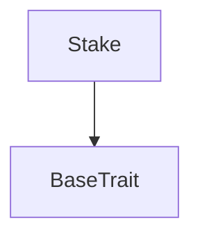
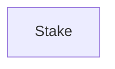

# TACT Compilation Report
Contract: Stake
BOC Size: 2104 bytes

# Types
Total Types: 34

## StateInit
TLB: `_ code:^cell data:^cell = StateInit`
Signature: `StateInit{code:^cell,data:^cell}`

## StdAddress
TLB: `_ workchain:int8 address:uint256 = StdAddress`
Signature: `StdAddress{workchain:int8,address:uint256}`

## VarAddress
TLB: `_ workchain:int32 address:^slice = VarAddress`
Signature: `VarAddress{workchain:int32,address:^slice}`

## Context
TLB: `_ bounced:bool sender:address value:int257 raw:^slice = Context`
Signature: `Context{bounced:bool,sender:address,value:int257,raw:^slice}`

## SendParameters
TLB: `_ bounce:bool to:address value:int257 mode:int257 body:Maybe ^cell code:Maybe ^cell data:Maybe ^cell = SendParameters`
Signature: `SendParameters{bounce:bool,to:address,value:int257,mode:int257,body:Maybe ^cell,code:Maybe ^cell,data:Maybe ^cell}`

## Deploy
TLB: `deploy#946a98b6 queryId:uint64 = Deploy`
Signature: `Deploy{queryId:uint64}`

## DeployOk
TLB: `deploy_ok#aff90f57 queryId:uint64 = DeployOk`
Signature: `DeployOk{queryId:uint64}`

## FactoryDeploy
TLB: `factory_deploy#6d0ff13b queryId:uint64 cashback:address = FactoryDeploy`
Signature: `FactoryDeploy{queryId:uint64,cashback:address}`

## TransferTON
TLB: `transfer_ton#1029b102 to_address:address value:coins = TransferTON`
Signature: `TransferTON{to_address:address,value:coins}`

## MintByOwner
TLB: `mint_by_owner#5fcc3d14 mint_to:address content:^cell = MintByOwner`
Signature: `MintByOwner{mint_to:address,content:^cell}`

## TokenNotification
TLB: `token_notification#7362d09c query_id:uint64 amount:coins from:address forward_payload:remainder<slice> = TokenNotification`
Signature: `TokenNotification{query_id:uint64,amount:coins,from:address,forward_payload:remainder<slice>}`

## MintJetton
TLB: `mint_jetton#00000015 query_id:uint64 amount:coins receiver:address = MintJetton`
Signature: `MintJetton{query_id:uint64,amount:coins,receiver:address}`

## TokenExcesses
TLB: `token_excesses#d53276db queryId:uint64 = TokenExcesses`
Signature: `TokenExcesses{queryId:uint64}`

## TokenBurn
TLB: `token_burn#595f07bc query_id:uint64 amount:coins response_destination:Maybe address custom_payload:Maybe ^cell = TokenBurn`
Signature: `TokenBurn{query_id:uint64,amount:coins,response_destination:Maybe address,custom_payload:Maybe ^cell}`

## Claim
TLB: `claim#5e922628 query_id:uint64 owner_address:address wallet_address:address signature:^slice = Claim`
Signature: `Claim{query_id:uint64,owner_address:address,wallet_address:address,signature:^slice}`

## Released
TLB: `released#cebf59cb query_id:uint64 = Released`
Signature: `Released{query_id:uint64}`

## Deposit
TLB: `deposit#042a3d29 query_id:uint64 amount:coins out_amount:coins mint_count:uint32 duration:uint32 owner_address:address signature:^slice max_claims:uint32 = Deposit`
Signature: `Deposit{query_id:uint64,amount:coins,out_amount:coins,mint_count:uint32,duration:uint32,owner_address:address,signature:^slice,max_claims:uint32}`

## ProxyMsg
TLB: `proxy_msg#e7f88ddb query_id:uint64 to:address value:coins body:Maybe ^cell = ProxyMsg`
Signature: `ProxyMsg{query_id:uint64,to:address,value:coins,body:Maybe ^cell}`

## UpdatePublicKey
TLB: `update_public_key#5f4f68d6 query_id:uint64 new_public_key:uint256 = UpdatePublicKey`
Signature: `UpdatePublicKey{query_id:uint64,new_public_key:uint256}`

## UpdateFeeAddress
TLB: `update_fee_address#07c641ee query_id:uint64 new_fee_address:address = UpdateFeeAddress`
Signature: `UpdateFeeAddress{query_id:uint64,new_fee_address:address}`

## UpdateJettonAddress
TLB: `update_jetton_address#aed28976 query_id:uint64 new_jetton_address:address = UpdateJettonAddress`
Signature: `UpdateJettonAddress{query_id:uint64,new_jetton_address:address}`

## UpdateNftAddress
TLB: `update_nft_address#d25ed2fb query_id:uint64 new_nft_address:address = UpdateNftAddress`
Signature: `UpdateNftAddress{query_id:uint64,new_nft_address:address}`

## TransferOwnership
TLB: `transfer_ownership#6b58f3fd query_id:uint64 new_owner:address = TransferOwnership`
Signature: `TransferOwnership{query_id:uint64,new_owner:address}`

## Claimed
TLB: `claimed#5f972844 query_id:uint64 = Claimed`
Signature: `Claimed{query_id:uint64}`

## DoMint
TLB: `do_mint#a67ba7f7 query_id:uint64 receiver:address sender:address signature:^slice mint_count:uint32 amount:coins wallet_address:address fees:coins = DoMint`
Signature: `DoMint{query_id:uint64,receiver:address,sender:address,signature:^slice,mint_count:uint32,amount:coins,wallet_address:address,fees:coins}`

## Restake
TLB: `restake#58cc6638 query_id:uint64 = Restake`
Signature: `Restake{query_id:uint64}`

## Withdraw
TLB: `withdraw#ba28f50d query_id:uint64 signature:^slice wallet_address:address = Withdraw`
Signature: `Withdraw{query_id:uint64,signature:^slice,wallet_address:address}`

## RestakeOldStake
TLB: `restake_old_stake#f194bcf4 query_id:uint64 stake_id:uint64 = RestakeOldStake`
Signature: `RestakeOldStake{query_id:uint64,stake_id:uint64}`

## WithdrawOldStake
TLB: `withdraw_old_stake#3a1ae31b query_id:uint64 stake_id:uint64 signature:^slice wallet_address:address = WithdrawOldStake`
Signature: `WithdrawOldStake{query_id:uint64,stake_id:uint64,signature:^slice,wallet_address:address}`

## OldStakeRecord
TLB: `_ stake_amount:coins out_amount:coins mint_count:uint8 max_claims:uint32 claims_count:uint32 stake_time:uint32 created_at:uint32 next_claim:uint32 last_claim:uint32 end_time:uint32 wallet_address:address = OldStakeRecord`
Signature: `OldStakeRecord{stake_amount:coins,out_amount:coins,mint_count:uint8,max_claims:uint32,claims_count:uint32,stake_time:uint32,created_at:uint32,next_claim:uint32,last_claim:uint32,end_time:uint32,wallet_address:address}`

## AddOldStakeRecord
TLB: `add_old_stake_record#8cddb2b2 query_id:uint64 stake_id:uint64 user_address:address stake_amount:coins out_amount:coins mint_count:uint8 max_claims:uint32 claims_count:uint32 stake_time:uint32 created_at:uint32 next_claim:uint32 last_claim:uint32 end_time:uint32 signature:^slice wallet_address:address = AddOldStakeRecord`
Signature: `AddOldStakeRecord{query_id:uint64,stake_id:uint64,user_address:address,stake_amount:coins,out_amount:coins,mint_count:uint8,max_claims:uint32,claims_count:uint32,stake_time:uint32,created_at:uint32,next_claim:uint32,last_claim:uint32,end_time:uint32,signature:^slice,wallet_address:address}`

## ClaimOldStake
TLB: `claim_old_stake#48243a66 query_id:uint64 stake_id:uint64 wallet_address:address signature:^slice = ClaimOldStake`
Signature: `ClaimOldStake{query_id:uint64,stake_id:uint64,wallet_address:address,signature:^slice}`

## StakeMaster$Data
TLB: `null`
Signature: `null`

## Stake$Data
TLB: `null`
Signature: `null`

# Get Methods
Total Get Methods: 12

## getAmount

## getOutAmount

## getCreatedAt

## getStakeTime

## getNextClaim

## getMintCount

## getMasterAddress

## getOwnerAddress

## getMaxClaims

## getClaimsCount

## getRequiredValue

## getId

# Error Codes
2: Stack underflow
3: Stack overflow
4: Integer overflow
5: Integer out of expected range
6: Invalid opcode
7: Type check error
8: Cell overflow
9: Cell underflow
10: Dictionary error
11: 'Unknown' error
12: Fatal error
13: Out of gas error
14: Virtualization error
32: Action list is invalid
33: Action list is too long
34: Action is invalid or not supported
35: Invalid source address in outbound message
36: Invalid destination address in outbound message
37: Not enough TON
38: Not enough extra-currencies
39: Outbound message does not fit into a cell after rewriting
40: Cannot process a message
41: Library reference is null
42: Library change action error
43: Exceeded maximum number of cells in the library or the maximum depth of the Merkle tree
50: Account state size exceeded limits
128: Null reference exception
129: Invalid serialization prefix
130: Invalid incoming message
131: Constraints error
132: Access denied
133: Contract stopped
134: Invalid argument
135: Code of a contract was not found
136: Invalid address
137: Masterchain support is not enabled for this contract
2512: Stake not found
4429: Invalid sender
5165: Not enough value
12603: Only owner can proxy message
14534: Not owner
14562: Not enough claims
15215: Only owner can update jetton address
20993: Only owner can restake
21750: Only owner can update nft address
22565: Not enough balance
26825: Only owner can withdraw
30318: Only master can withdraw
34646: Only owner can store TONs
45220: Max claims reached
48007: Only master contract can store TONs
48401: Invalid signature
53618: Only master contract can proxy message
53983: Price requirement is not met
56818: Stake is not active
59508: Only owner can update fee address
61734: Only owner can deposit
62971: Only owner can transfer ownership
63694: Early withdrawal

# Trait Inheritance Diagram

# Contract Dependency Diagram

